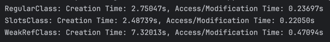
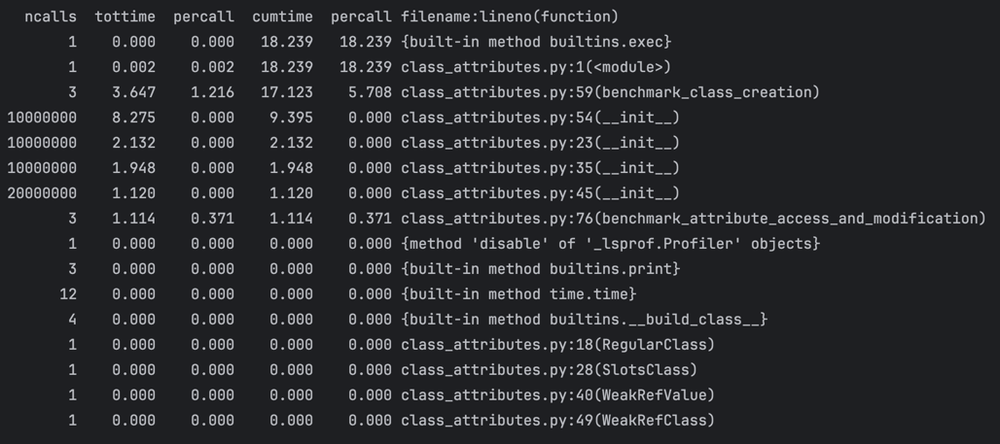
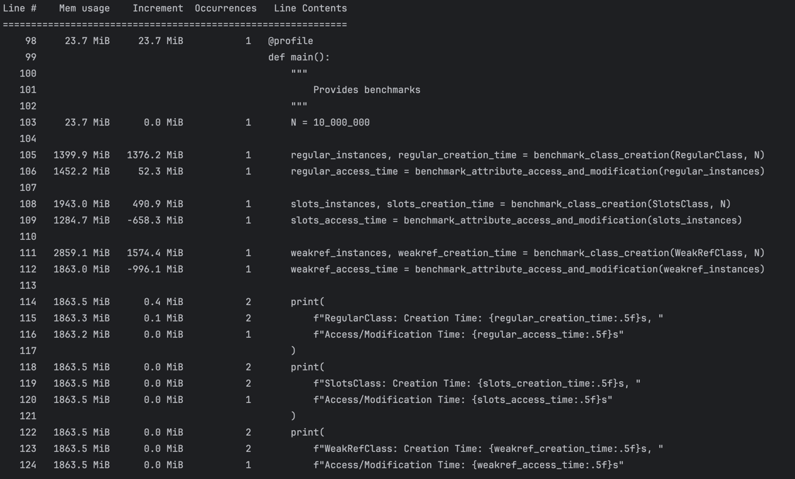
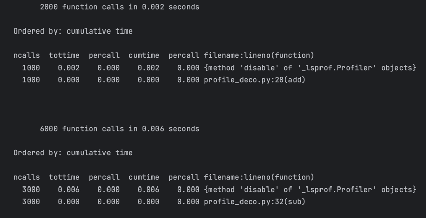

I. 

1) Класс с обычными атрибутами. Время создания: 2.75 секунд, Время доступа/изменения: 0.24 секунды.
2) Класс со слотами. Время создания: 2.49 секунды, Время доступа/изменения: 0.22 секунды.
3) Класс с атрибутами weakref. Время создания: 7.32 секунды, Время доступа/изменения: 0.47 секунды.

Класс со слотами создается, предоставляет доступ к аргументм, модифицируется быстрее обычного класса, т.к. не создаёт словарь __dict__ и имеет прямой доступу к атрибутам через слоты. 
Операции над третьим классом самые медленные, это связано с использованием слабых ссылок через weakref.ref и созданием вспомогательных объектов WeakRefValue (т.к. на инты делать слабые ссылки нельзя)

**Вывод:** SlotsClass превосходит RegularClass, особенно в задачах с большим числом объектов. Однако он менее гибок и не позволяет добавлять новые атрибуты. WeakRefClass подходит для задач, где важно избегать долгого удержания объектов в памяти, однако это может ухудшить производительность.

II. 

Здесь видно, что большую часть времени занимает создание классов со слабыми ссылками, далее - классы с обычными аргументами, и далее - класс со слотами. Профилировщик подтвердил результаты выше.

Для RegularClass (строка 105):
Использование памяти увеличивается на 1376.2 MiB.
Для SlotsClass (строка 108):
Увеличение составляет 490.9 MiB, что значительно меньше, благодаря оптимизации памяти через __slots__.
Для WeakRefClass (строка 111):
Увеличение составило 1574.4 MiB, что больше, так как используются слабые ссылки, которые менее эффективны в плане памяти.

III. 

Здесь видим, что общее количество вызовов удвоено по каждой из функций add, sub, т.к учитываются еще и отключения профайлера.